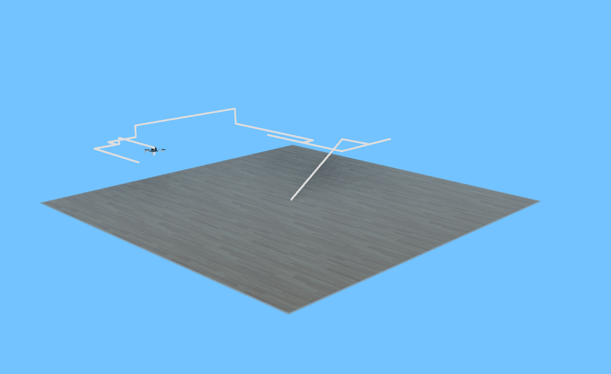

# Replicador de voo Crazyflie em Simulação




> O projeto visa replicar o voo e as leituras dos sensores de distância de um drone Crazyflie real no simulador Webots, facilitando e melhorando a visualização

### Ajustes e melhorias

O projeto ainda está em desenvolvimento e as próximas atualizações serão voltadas nas seguintes tarefas:

- [x] Gerar movimentação com base em coordenadas no simulador
- [x] Marcar a movimentação na simulação
- [ ] Replicar a trajetória com base em arquivo de saída do drone real
- [ ] Marcar leituras dos sensores de distância na simulação
- [ ] Integração com ROS2 para tempo real

## 💻 Pré-requisitos

Antes de começar, verifique se você atendeu aos seguintes requisitos:
* Você instalou a versão mais recente do Webots
* Você tem uma máquina Linux (Recomendado, mas não exclusivo).

## 🚀 Instalando e usando o Replicador de voo Crazyflie em Simulação

Para instalar e usar, siga estas etapas:
1. Clone o repositório
2. No diretório do projeto:
``` webots worlds/flight_reproduction.wbt ```
